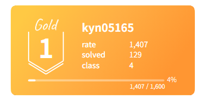

<h1 align="center">안녕하세요, 이정현입니다 👋</h1>

  데이터를 실제 서비스로 완성하는 백엔드 개발을 지향합니다 🚀 
  <a href="https://jhyungit.github.io/">🌐 포트폴리오</a> ·
  <a href="https://tripcrew.duckdns.org">🧳 TripCrew 라이브</a>

  
  
  
  

---

## 🧑‍💻 About Me

| 항목 | 내용 |
|------|------|
| 🎓 **학력** | 명지대학교 정보통신공학과 졸업 |
| 🏫 **교육** | SSAFY 15기 Java 전공반 · T-academy 빅데이터 분석가 과정 수료 |
| 💼 **경험** | 기업은행 IT그룹 청년인턴 (우수인턴 선정) · 달리셔스 기업연계 프로젝트 (우수상) |
| 🌏 **해외** | 호주 워킹홀리데이 약 1년 (어학연수 + 현지 근무) |
| 🛠 **강점** | 백엔드 개발 · DB 조회 성능 최적화 · 데이터 기반 문제 해결 |
| 📜 **자격** | 정보처리기사 · SQLD · OPIc IH |

> 데이터 분석에서 시작해, 분석 결과를 사용자가 쓰는 서비스로 완성하기 위해 백엔드 개발로 영역을 넓혀왔습니다.

---

## 🔧 Tech Stack

### 💻 Language

### 🗄️ Backend & Database

### 🖥️ Frontend

### ⚙️ Infra & Tools

### 📊 Data & ML

---

## 📌 Main Projects

### 🧳 TripCrew | 여행 계획 협업 플랫폼 (SSAFY 관통 프로젝트)
> Spring Boot 기반 풀스택 협업 서비스 · 2인 팀 · **AWS 배포 운영 중**

- **조회 성능 최적화**: 관리자 대시보드 회원 조회를 전체 로드 → 서버 페이징 + 복합 인덱스로 개선. 30만 건 기준 **응답 0.473초 → 0.018초 (약 26배)**, `EXPLAIN`으로 filesort 제거 검증
- **데이터 정합성**: 여행 계획 공동 편집에 낙관적 락 적용 → 동시 수정 충돌 시 409 응답 및 병합 처리
- **인증/실시간**: JWT + Refresh Token 인증, WebSocket + Redis Pub/Sub 기반 실시간 공동 편집
- **인프라**: Docker Compose(MySQL·Redis·Backend·Caddy) 4컨테이너, AWS EC2 배포, Flyway DB 버전 관리
- **기술 스택**: Java 17, Spring Boot, MyBatis, MySQL, Redis, Vue 3

🔗 [Live](https://tripcrew.duckdns.org) · [GitHub Repository](https://github.com/tripcrew/tripcrew)

---

### 🍽 콘텐츠 기반 메뉴 추천 시스템 | T-academy × 달리셔스
> 고객 데이터 및 음식 태그 기반 맞춤 추천 시스템 구축 (5인 팀 리딩)

- Content-based Filtering + 하이브리드 모델 도입 → **수동 작업 30분 → 3분, 효율 약 90% 개선**
- Cosine Similarity 기반 유사도 계산으로 추천 정확도 향상
- 성과로 **신규 고객 2만 명 보유 고객사(SPARKPLUS) 계약 확보에 기여**
- 📰 [동아일보 기사 소개](https://www.donga.com/news/It/article/all/20230503/119128322/1#in_cont)

🔗 [GitHub Repository](https://github.com/jhyungit/Final_project)

---

### 🏦 기업은행 슈퍼앱 서비스 기획 | IBK 청년인턴
> IT그룹에서 타 금융사 슈퍼앱 벤치마킹 및 서비스 개선안 제안

- i-ONE Bank 등 **4개 앱 통합** 슈퍼앱 Figma 프로토타입 설계
- 개인고객/기업고객 특성을 반영한 Flowchart 로직 설계
- **IT본부장 참석 최종 발표에서 우수팀 선정 및 우수인턴 수료**

---

### 🌐 React 기반 개인 웹 포트폴리오
> 컴포넌트 단위 UI 설계 및 GitHub Pages 배포

- Figma 프로토타입 사전 설계 후 재사용성·유지보수를 고려한 컴포넌트 구조로 구현
- **기술 스택**: React, Vite, CSS, GitHub Pages

🔗 [Portfolio Site](https://jhyungit.github.io/)

---

## 🏅 Algorithm

  

  <a href="https://github.com/jhyungit/coding_test_practice">💻 프로그래머스 풀이 저장소</a> ·
  <a href="https://github.com/jhyungit/SsafyDevCT">📝 SSAFY 코딩테스트 스터디</a>

---

## 📫 Contact

  
  

